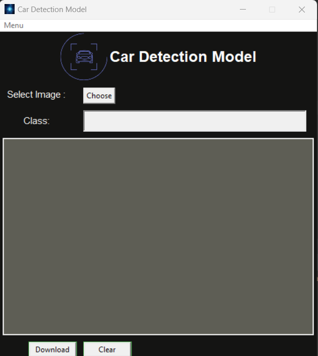

# Car Class Detection Model with RCNN

This repository contains a car class detection model implemented using RCNN (Region-based Convolutional Neural Network). The model is capable of detecting cars in images and providing bounding box information.

## Requirements

Make sure you have the required packages installed. You can install them by running the following command:

```shell
pip install -r requirements.txt

```
##Usage
1. Clone the repository:
 ```shell
git clone https://github.com/sarathprasadam/CarDetectionModel.git
```
2. Navigate to the project directory:
```shell
cd ../CarDetectionModel
```
3. Run main.py script
 ```shell
python main.py
```

  
